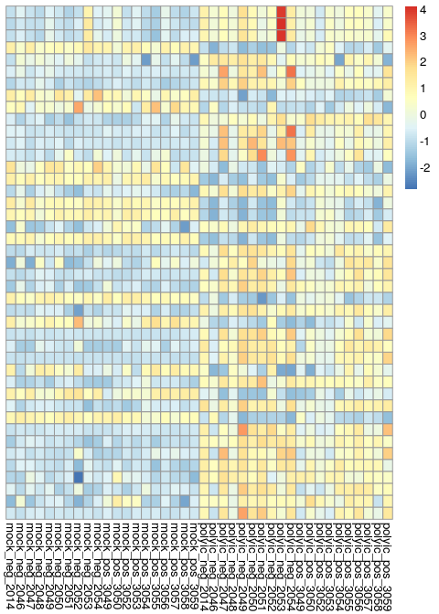
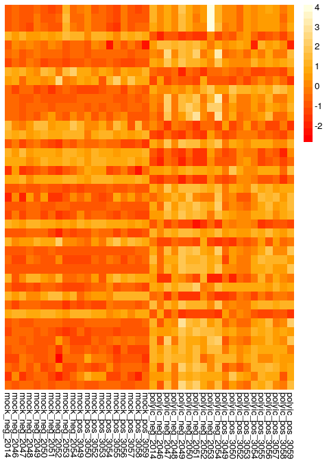
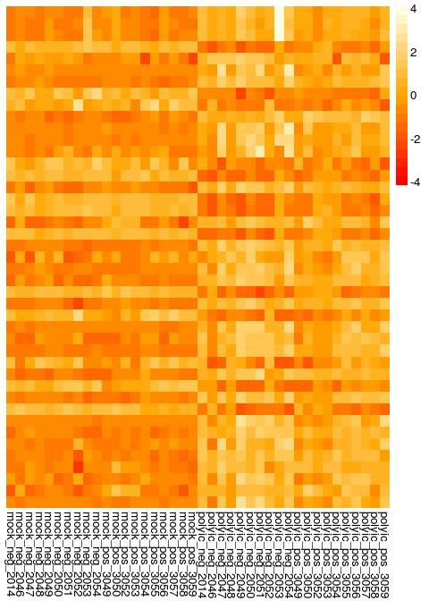
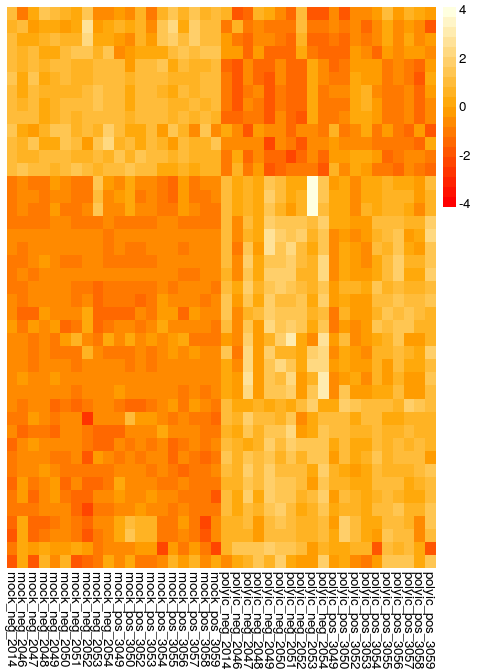
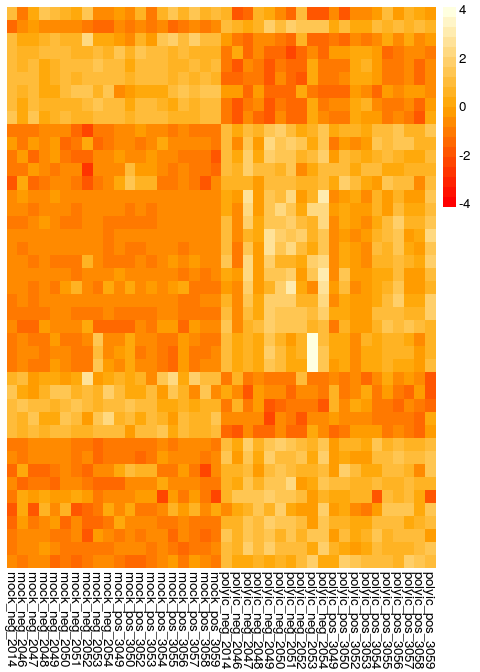
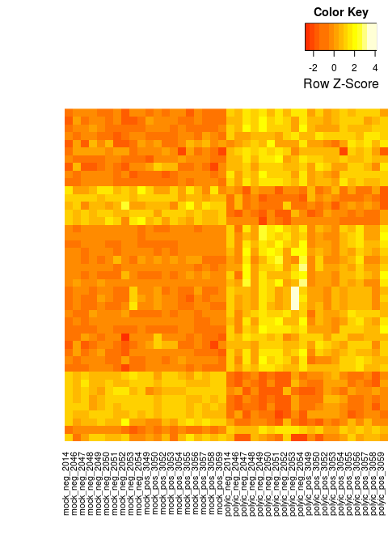

# Example: Differential Expression and Heatmap
Brian High  
3/1/2015  

## Assignment

Reproduce Figure 2 of the following paper: 
http://www.ncbi.nlm.nih.gov/pubmed/23220997

1. Get the data from GEO
2. Normalize the data (if necessary)
3. Use limma to test for differential expression
4. Display the results using a heatmap [Hint: Use the pheatmap package]

## Using Shirley Chang's analysis code

The majority of the code used for this example was adapted, with permission, 
from the Github repository of Shirley Chang - 
[sisily](https://github.com/sisily/HW2-sisily).

## Set up


```r
# Set some global knitr options
library("knitr")
opts_chunk$set(tidy=FALSE, cache=FALSE, messages=FALSE, fig.width=5, fig.height=7)
```

### Install and load the needed packages


```r
packages <- c("GEOquery", "reshape", "limma", "pheatmap", "gplots")
source("http://bioconductor.org/biocLite.R")
```

```
## Bioconductor version 3.0 (BiocInstaller 1.16.1), ?biocLite for help
```

```r
for (pkg in packages) { 
    require(pkg, character.only = TRUE) || { 
        biocLite(pkg) && library(pkg, character.only = TRUE)
    }
}
```

```
## Loading required package: GEOquery
## Loading required package: Biobase
## Loading required package: BiocGenerics
## Loading required package: parallel
## 
## Attaching package: 'BiocGenerics'
## 
## The following objects are masked from 'package:parallel':
## 
##     clusterApply, clusterApplyLB, clusterCall, clusterEvalQ,
##     clusterExport, clusterMap, parApply, parCapply, parLapply,
##     parLapplyLB, parRapply, parSapply, parSapplyLB
## 
## The following object is masked from 'package:stats':
## 
##     xtabs
## 
## The following objects are masked from 'package:base':
## 
##     Filter, Find, Map, Position, Reduce, anyDuplicated, append,
##     as.data.frame, as.vector, cbind, colnames, do.call,
##     duplicated, eval, evalq, get, intersect, is.unsorted, lapply,
##     mapply, match, mget, order, paste, pmax, pmax.int, pmin,
##     pmin.int, rank, rbind, rep.int, rownames, sapply, setdiff,
##     sort, table, tapply, union, unique, unlist, unsplit
## 
## Welcome to Bioconductor
## 
##     Vignettes contain introductory material; view with
##     'browseVignettes()'. To cite Bioconductor, see
##     'citation("Biobase")', and for packages 'citation("pkgname")'.
## 
## Setting options('download.file.method.GEOquery'='curl')
## Loading required package: reshape
## Loading required package: limma
## 
## Attaching package: 'limma'
## 
## The following object is masked from 'package:BiocGenerics':
## 
##     plotMA
## 
## Loading required package: pheatmap
## Loading required package: gplots
## 
## Attaching package: 'gplots'
## 
## The following object is masked from 'package:stats':
## 
##     lowess
```

## Process the data that we want

### Step 1: Get the data


```r
# Create the data folder if it does not already exist
datadir <- "./Data/GEO/"
dir.create(file.path(datadir), showWarnings = FALSE, recursive = TRUE)

# Construct the data file path from the accession code and folder path
accession <- "GSE40812"
datafile <- paste(c(datadir, accession, "_series_matrix.txt.gz"), collapse = "")

# Download the datafile if it does not already exist and load into eset
if (file.exists(datafile)) {
    # Load the data from the previously downloaded data file using getGEO
    gds <- getGEO(filename = datafile) # getGEO returns an "S4" object
} else {
    # Query GEO for the GEO object matching the accession number
    gds <- getGEO(accession, destdir = datadir)[[1]]  # getGEO returns a "list"
}
```

```
## File stored at: 
## /tmp/RtmpufPmqx/GPL10558.soft
```

### Step 2: Only use "Monocyte-derived Macrophage" data


```r
pd<-pData(gds)
mmpd <- pd[pd$source_name_ch1=="Monocyte-derived Macrophage",]
rownames(mmpd)
```

```
##  [1] "GSM1002366" "GSM1002367" "GSM1002368" "GSM1002369" "GSM1002370"
##  [6] "GSM1002371" "GSM1002372" "GSM1002373" "GSM1002374" "GSM1002375"
## [11] "GSM1002376" "GSM1002377" "GSM1002378" "GSM1002379" "GSM1002380"
## [16] "GSM1002381" "GSM1002382" "GSM1002383" "GSM1002384" "GSM1002385"
## [21] "GSM1002386" "GSM1002387" "GSM1002388" "GSM1002389" "GSM1002390"
## [26] "GSM1002391" "GSM1002392" "GSM1002393" "GSM1002394" "GSM1002395"
## [31] "GSM1002396" "GSM1002397" "GSM1002398" "GSM1002399" "GSM1002400"
## [36] "GSM1002401" "GSM1002402" "GSM1002403" "GSM1002404" "GSM1002405"
```

```r
mmeset <- gds[,rownames(mmpd)]
```

### Step 3: Sanitize the data


```r
mmpd$subj <- substring(gsub("^[A-Z][A-Z][0-9]+_","",mmpd[,'title']),1,4)
mmpd$HCV <- gsub(".*: ", "", mmpd$characteristics_ch1)
mmpd$HCV <- factor(ifelse(mmpd$HCV =="Neg","neg","pos"))
mmpd$Poly_IC <- tolower(gsub(".*: ","", mmpd$characteristics_ch1.2))
mmpd$Poly_IC <- factor(ifelse(mmpd$Poly_IC == "mock","mock","polyic"))
mmpd <- mmpd[,c('geo_accession','subj','Poly_IC','HCV')]
```

### Step 4: Use limma to design matrix for treatment

Get the probes that are differentially expressed between the "treatment" 
groups (p<0.05 and a fold change of > 1.5)


```r
mm_tx <- model.matrix(~Poly_IC,mmpd)
fit_tx <- lmFit(exprs(mmeset), mm_tx)
ebay_tx <- eBayes(fit_tx)
top_tx <- topTable(ebay_tx, coef="Poly_ICpolyic", number=Inf)
probes_tx <- top_tx[top_tx$adj.P.Val < 0.05 & abs(top_tx$logFC)>log2(1.5), ]
nrow(probes_tx) # getting 1146 probes
```

```
## [1] 1146
```

### Step 5: Subset the pData by Poly_IC value


```r
mmpd$Poly_IC_Int <- ifelse(mmpd$Poly_IC == "mock", -1, 1) 
exprs.probes_tx <- exprs(mmeset)[rownames(probes_tx),]

# Each subject has 2 GEO numbers: one corresponds to a mock and the other 
# a poly value (-1 is mock and 1 is poly)

mmpd.cast <- cast(mmpd, subj~geo_accession, value = "Poly_IC_Int")
rownames(mmpd.cast) <- mmpd.cast[,'subj']
mmpd.cast[is.na(mmpd.cast)] <- 0
exprs.probes_tx.diff <- exprs.probes_tx%*%t(mmpd.cast)
nrow(exprs.probes_tx.diff); ncol(exprs.probes_tx.diff)
```

```
## [1] 1146
```

```
## [1] 20
```

### Step 6: Design matrix again for HCV 

Find the probes that are differentially expressed between HCV+ and HCV- (p<0.1)

The expression data is ordered by subject ID.


```r
mmpd.ordered <- unique(mmpd[,c('subj','HCV')])
mmpd.ordered <- mmpd.ordered[order(mmpd.ordered$subj),] 
```

Test differential expressed between HCV+ and HCV-.


```r
mm_HCV <- model.matrix(~HCV,mmpd.ordered)
fit_HCV <- lmFit(exprs.probes_tx.diff, mm_HCV)
ebay_HCV <- eBayes(fit_HCV)
Top_HCV <- topTable(ebay_HCV, coef="HCVpos", number=Inf)
```

Only include probes with differential expression P values less than 0.1.


```r
figure_probes <- Top_HCV[Top_HCV$P.Value < 0.1,]
figure_probes <- rownames(figure_probes)
length(figure_probes) # probe number =43
```

```
## [1] 43
```

## Reproduce Figure 2 of the paper using heatmap

### Step 1: Calculate the z value of each probe

This will allow us to manually apply z-score scaling.


```r
figure_probes.exprs <- exprs.probes_tx[figure_probes,]

z_scores <- function(row){
  row <- t(as.matrix(row))
  xbar <- mean(row)
  sdev <- sd(row)
  z_scores <- rep(0,ncol(row))
  for(i in 1:ncol(row)){
    z_scores[i] <- (row[i]-xbar)/sdev
  }
  return(z_scores)
}

z <- rep(0,40) 
    for(i in 1:nrow(figure_probes.exprs)){
  z <- rbind(z,z_scores(figure_probes.exprs[i,]))
    }

z <- z[-1,]
```

### Step 2: Use pheatmap to create the figure 

Rename the columns, then sort the columns, and create the heatmap.


```r
# Use more descriptive column names instead of creating the labeled dendrogram
colnames(z) <- paste(mmpd$Poly_IC, mmpd$HCV, mmpd$subj, sep="_")

# Sort by column name (which is by treatment, infection status, and subject)
z <- z[,order(colnames(z))]

# Produce the heatmap using pheatmap, preserving column and row order
pheatmap(z, cluster_rows=F, cluster_cols=F, legend=TRUE)
```

 

Produce some alternate heatmaps for practice.


```r
# Use alternate color palatte
hmcols<-colorRampPalette(c("red", "orange", "lightyellow"))(20)
pheatmap(z, cluster_rows=F, cluster_cols=F, legend=TRUE, color=hmcols)
```

 

```r
# Remove grey border
pheatmap(z, cluster_rows=F, cluster_cols=F, legend=TRUE, color=hmcols, border_color=NA)
```

 

```r
# Use "scale" instead of custom calculated z-score scaling
colnames(figure_probes.exprs) <- paste(mmpd$Poly_IC, mmpd$HCV, mmpd$subj, sep="_")
figure_probes.exprs <- figure_probes.exprs[,order(colnames(figure_probes.exprs))]
pheatmap(figure_probes.exprs, cluster_rows=F, cluster_cols=F, scale="row", legend=TRUE, color=hmcols, show_rownames=FALSE, border_color=NA)
```

 

```r
# Set clustering_distance_rows to euclidean
pheatmap(figure_probes.exprs, cluster_rows=T, cluster_cols=F, scale="row", legend=TRUE, color=hmcols, clustering_method="ward", show_rownames=FALSE, treeheight_row=0, clustering_distance_rows="euclidean", border_color=NA)
```

```
## The "ward" method has been renamed to "ward.D"; note new "ward.D2"
```

 

```r
# Set clustering_distance_rows to euclidean manually
drows <- dist(figure_probes.exprs, method = "euclidean")
pheatmap(figure_probes.exprs, cluster_rows=T, cluster_cols=F, scale="row", legend=TRUE, color=hmcols, clustering_method="ward", show_rownames=FALSE, treeheight_row=0, clustering_distance_rows=drows, border_color=NA)
```

```
## The "ward" method has been renamed to "ward.D"; note new "ward.D2"
```

 

```r
# Using heatmap.2
library(gplots)
hclust.ward <- function(x) hclust(x, method="ward.D2")
dist.eucl <- function(x) dist(x, method="euclidean")
heatmap.2(figure_probes.exprs, scale="row", dendrogram = "none",  
          symkey=FALSE, density.info="none", trace="none", 
          cexRow=0.7, cexCol=1, margins=c(10,0), labRow=FALSE, 
          lmat=rbind( c(0, 3, 4), c(2,1,1) ), lwid=c(1, 3, 2), 
          hclustfun=hclust.ward, distfun=dist.eucl, Colv=NA, 
          key=TRUE, keysize=1.0
          )
```

 
